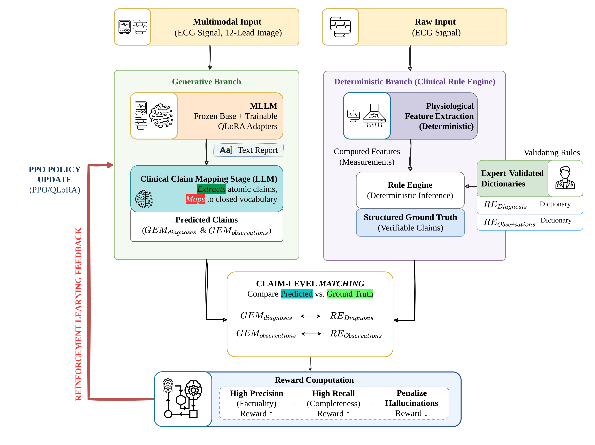

# VeriECG: Symbolic-Verified ECG Reporting via Reinforcement Learning
<div align="center">
    <p><i>Grounding vision-language ECG report generation in deterministic, rule-based clinical evidence</i></p>
    <p><strong>Mariano Barone</strong> · <strong>Luisa Ciniglio</strong> · <strong>Francesco Di Serio</strong> · <strong>Vincenzo Moscato</strong> · <strong>Roberto Moio</strong> · <strong>Marco Postiglione</strong> · <strong>Giuseppe Riccio</strong> · <strong>Antonio Romano</strong></p>
<div align="center">
    <a href="LICENSE" target="_blank"></a>
</div>
</div>

<hr>

## 📋 Overview

**VeriECG** is a pipeline for closing the loop between vision-language ECG report generation and clinical verifiability. It fine-tunes [GEM](https://github.com/lanxiang1017/GEM) (a LLaVA + ECG-CoCa model that generates free-text reports from 12-lead ECGs) with reinforcement learning, using a **deterministic, symbolic rule engine** — not another neural model — as the source of ground truth reward.

Raw ECG signals from a PTB-XL subset are processed by a beat-level feature extractor and a clinical rule engine to produce verifiable observations and diagnoses. GEM's free-text reports are then parsed by an LLM-based claim mapper into the same structured vocabulary, so that generated claims can be checked against the rule-engine ground truth and used as a reward signal for PPO + LoRA fine-tuning.

## ❌ The Problem

Vision-language ECG report generators produce fluent, plausible-sounding text, but nothing in standard training enforces that every stated finding is actually supported by the signal:

- reports can assert abnormalities that are not present in the waveform, or omit ones that are;
- comparing full reports as unstructured text hides *which* individual findings are correct and which are hallucinated;
- without a **symbolic**, auditable ground truth, RL fine-tuning has no reliable, decomposable reward signal to align generation with clinical evidence;
- observation-level errors (fabricated evidence) and diagnosis-level errors (wrong conclusion from correct evidence) are clinically different failures and should not be scored the same way.

## 🏗️ Architecture

VeriECG runs two parallel branches over the same ECG — a **generative** branch (GEM + claim mapper) and a **deterministic** branch (physiological feature extraction + rule engine) — and closes the loop by scoring the generative branch's claims against the deterministic branch's structured ground truth, feeding the result back as a PPO reward.

<div align="center">
    
    <p><i>Figure 1: The VeriECG pipeline. The generative branch (left) has GEM produce a free-text report from the ECG, which an LLM claim mapper reduces to atomic claims in a closed vocabulary. The deterministic branch (right) extracts physiological features from the same signal and runs them through an expert-validated rule engine to obtain structured, verifiable ground truth. Claim-level matching compares the two, and the resulting precision/recall-based reward drives the PPO/LoRA policy update.</i></p>
</div>

*(vector version: <a href="imgs/pipeline.pdf">imgs/pipeline.pdf</a>)*

### Main Components

| Component | Description | Notes |
|---|---|---|
| **Rule engine** (`rule_engine/`) | Deterministic beat-level feature extraction (via a vendored FeatureDB) turned into observations and diagnoses through dictionary-driven clinical reasoning | Produces the ground truth used as reward reference |
| **GEM** (external) | LLaVA-based vision-language model with an ECG-CoCa signal encoder that generates free-text ECG reports | Cloned and patched via `setup/`, not vendored in this repo |
| **Claim mapper** (`mapping/`) | LLM that extracts structured observation/diagnosis IDs from GEM's free-text report against the rule engine's vocabulary | Default `meta-llama/Meta-Llama-3-8B-Instruct`; includes a regex negation-safety filter |
| **Reward functions** (`RL/reward_definition.py`) | Compare rule-engine ground truth against mapped GEM claims | Two variants: claim-level F-beta (`jha25`) and a 4-quadrant diagnosis/observation split (`strutturata`, active default) |
| **PPO/LoRA trainer** (`RL/training_rl.py`) | Fine-tunes GEM against the reward signal | 4-bit quantized base model with LoRA adapters |

### Key Files

| Area | Main files |
|---|---|
| Data preparation | `data/scripts/build_ptbxl_subset.py`, `data/scripts/build_prompt_dataset.py`, `data/scripts/run_gem.py` |
| Rule engine | `rule_engine/estrazione_feature_deterministiche_da_segnale.py`, `rule_engine/rule_engine.py`, `rule_engine/run_rule_engine.py` |
| Claim mapping | `mapping/mapping.py`, `mapping/OBS_LIST.json`, `mapping/DIAG_LIST.json` |
| RL training | `RL/build_dataset_RL.py`, `RL/training_rl.py`, `RL/reward_definition.py`, `RL/run_training.py` |
| Environment setup | `setup/setup_gem.py`, `setup/init_session.py` |

## ⚙️ Reward Functions

Two claim-level reward formulations are implemented in `RL/reward_definition.py`; the active one is selected via `REWARD_TRAINING`.

- **`jha25`** — DocLens-style claim metrics: observations and diagnoses are pooled into a single claim set, precision/recall are computed against the rule-engine ground truth, and the reward is a precision-weighted F-beta (β=0.5) score, scaled. This discourages the model from over-generating claims just to inflate recall.
- **`strutturata`** (default) — keeps diagnoses and observations as two independent F-beta scores, `q_d` and `q_o`, and combines them as `R = R_pos·q_d·q_o − P_o·(1−q_o) − P_d·(1−q_d)`, with `P_o > P_d`. Fabricated observations are penalized more heavily than an incorrect diagnosis built on correct evidence, with an explicit penalty for degenerate (empty) reports.

## 📁 Project Structure

```text
VeriECG/
├── README.md
├── LICENSE
├── data/
│   ├── ptbxl_subset/            # PTB-XL signal files (.dat/.hea) for the working subset
│   ├── ptbxl_subset.json        # id -> signal/image/prompt index
│   └── scripts/
│       ├── build_ptbxl_subset.py
│       ├── build_prompt_dataset.py
│       └── run_gem.py
├── rule_engine/
│   ├── Clinical_Observation_Dictionary.json
│   ├── Diagnosis_Dictionary.json
│   ├── estrazione_feature_deterministiche_da_segnale.py
│   ├── rule_engine.py
│   ├── run_rule_engine.py
│   ├── requirements_featuredb.txt
│   └── FeatureDB/                # vendored deterministic ECG feature-extraction library
├── mapping/
│   ├── mapping.py
│   ├── OBS_LIST.json
│   └── DIAG_LIST.json
├── RL/
│   ├── build_dataset_RL.py
│   ├── training_rl.py
│   ├── reward_definition.py
│   ├── run_training.py
│   └── requirements.txt
├── setup/
│   ├── setup_gem.py
│   ├── init_session.py
│   └── requirements.txt
└── update/                        # manual patches applied on top of the cloned GEM repo
    ├── models-GEM_model/config.json
    ├── llava-model/builder.py
    └── llava-model-multimodal_ecoder/
        ├── builder.py
        └── clip_encoder.py
```

`external/GEM/`, `models/`, `logs/`, and the raw `data/ecg_timeseries/`, `data/ecg_images/`, `data/ecg_bench/` folders are created at setup/run time and are gitignored.

### File Descriptions

| File / folder | Purpose |
|---|---|
| `data/scripts/` | Builds the PTB-XL working subset and the prompt/image index consumed by GEM and the rule engine. |
| `rule_engine/` | Deterministic feature extraction and dictionary-based clinical reasoning that produces the RL ground truth. |
| `mapping/` | LLM-based extraction of structured claims from GEM's free-text reports, aligned to the rule engine's vocabulary. |
| `RL/` | RL dataset construction, PPO+LoRA training loop, reward functions, and baseline-vs-post-RL evaluation. |
| `setup/` | Clones/downloads and patches GEM, ECG-CoCa, and the ECG-Grounding benchmark; installs the training environment. |
| `update/` | Manual patches to apply on top of the cloned GEM repo, on top of what `setup_gem.py` patches automatically. |

## 🚀 Quick Start

Two isolated environments are needed: FeatureDB pins `numpy==1.21.2`, which only ships wheels for **Python 3.9/3.10**, while the GEM/RL stack needs CUDA `torch`, `transformers==4.38.1`, and `bitsandbytes`.

### 1. Environments

```bash
# rule engine environment (Python 3.9 or 3.10)
python3.9 -m venv venv_featuredb
source venv_featuredb/bin/activate
pip install -r rule_engine/requirements_featuredb.txt

# GEM / RL environment (Python 3.10+, CUDA GPU)
python -m venv venv_rl
source venv_rl/bin/activate
pip install -r setup/requirements.txt
pip install -r RL/requirements.txt
```

### 2. Fetch and patch GEM

```bash
python setup/setup_gem.py      # clones GEM, downloads the GEM/ECG-CoCa checkpoints and the ECG-Grounding benchmark, patches config/compat files
python setup/init_session.py   # installs GEM as an editable package, applies the write->append patch
```

Then copy the manual patches under `update/` on top of the cloned `external/GEM/`:

| Patch file | Target |
|---|---|
| `update/models-GEM_model/config.json` | `models/GEM_model/config.json` |
| `update/llava-model/builder.py` | `external/GEM/llava/model/builder.py` |
| `update/llava-model-multimodal_ecoder/builder.py` | `external/GEM/llava/model/multimodal_encoder/builder.py` |
| `update/llava-model-multimodal_ecoder/clip_encoder.py` | `external/GEM/llava/model/multimodal_encoder/clip_encoder.py` |

### 3. Build the PTB-XL working subset

```bash
python data/scripts/build_ptbxl_subset.py     # filters PTB-XL down to the ECG-Grounding benchmark subset (2041 ECGs)
python data/scripts/build_prompt_dataset.py   # writes data/ptbxl_subset.json
```

### 4. Rule engine — deterministic ground truth

*(FeatureDB environment)*

```bash
python rule_engine/estrazione_feature_deterministiche_da_segnale.py
python rule_engine/run_rule_engine.py
```

Produces `rule_engine/output_rule_engine.json`: per-ECG observations and diagnoses used as ground truth.

### 5. RL fine-tuning

*(GEM/RL environment, GPU)*

```bash
python RL/build_dataset_RL.py   # pairs each ECG prompt with its rule-engine ground truth
python RL/run_training.py       # 85/15 train/eval split, PPO+LoRA fine-tuning, baseline vs post-RL comparison
```

Each run writes to `RL/output/run_XXX/`: per-example reports/claims/reward, `training_log.json`, comparison plots, and `run_info.txt`.

## 📊 Dataset

The working set is a **2041-ECG subset of PTB-XL**, filtered to the records covered by the `LANSG/ECG-Grounding` benchmark used to evaluate GEM. For each ECG, `data/ptbxl_subset.json` indexes the signal file, the rendered image, and the fixed generation prompt.

Ground truth is defined over two dictionaries:

- `rule_engine/Clinical_Observation_Dictionary.json` — per-lead/global clinical observations, with the deterministic feature conditions that satisfy each one.
- `rule_engine/Diagnosis_Dictionary.json` — diagnoses, each with required/optional supporting observations.

`mapping/OBS_LIST.json` and `mapping/DIAG_LIST.json` are slim vocabularies regenerated from these dictionaries and used to constrain what the claim mapper is allowed to extract.

### Data policy

Only lightweight code and JSON configuration are versioned. Raw ECG signals/images, the cloned GEM repository, model checkpoints, and run logs are excluded via `.gitignore` and must be regenerated locally through `setup/` and `data/scripts/`.

## 🤝 Contributing

Contributions are welcome through pull requests or issue reports. If you extend the pipeline, keep the rule engine's vocabulary, `mapping/OBS_LIST.json`/`DIAG_LIST.json`, and the RL ground truth in sync, and avoid committing large generated artifacts or model checkpoints.

## 🌐 Notes

- The repository is intended for research and reproducibility.
- The rule engine, GEM, and the RL loop each require separate, incompatible dependency stacks — see [Quick Start](#-quick-start).
- Outputs and reward scores are research artifacts, not a validated clinical decision-support tool.

## 📜 License

This work is licensed under a
[Creative Commons Attribution-NonCommercial 4.0 International License][cc-by-nc].

[![CC BY-NC 4.0][cc-by-nc-image]][cc-by-nc]

[cc-by-nc]: https://creativecommons.org/licenses/by-nc/4.0/
[cc-by-nc-image]: https://licensebuttons.net/l/by-nc/4.0/88x31.png
[cc-by-nc-shield]: https://img.shields.io/badge/License-CC%20BY--NC%204.0-lightgrey.svg

<div align="center">
    <p><i>Advancing verifiable Vision-Language Systems for healthcare research.</i></p>
</div>
